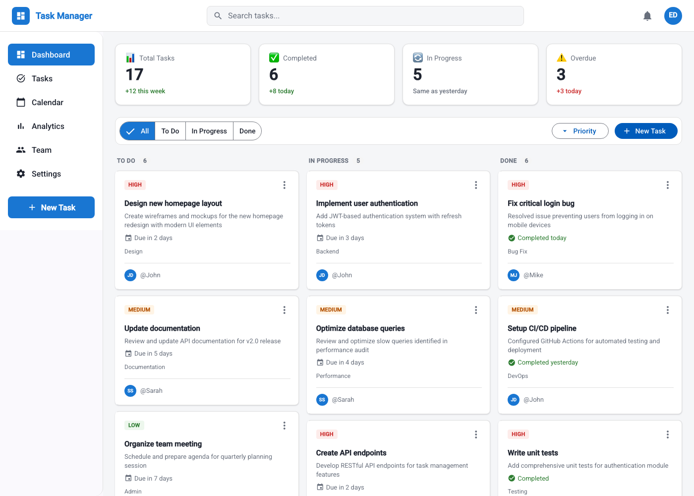
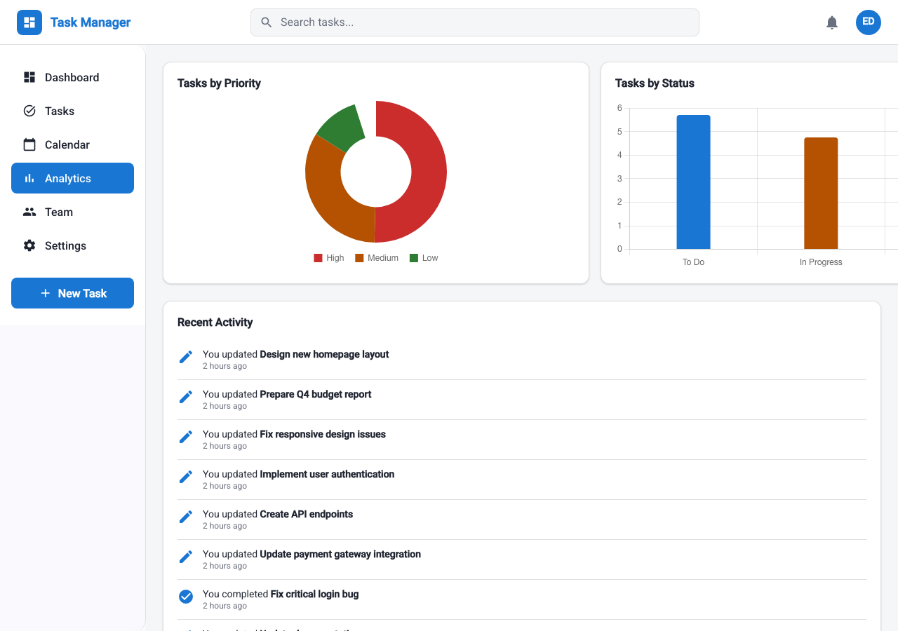
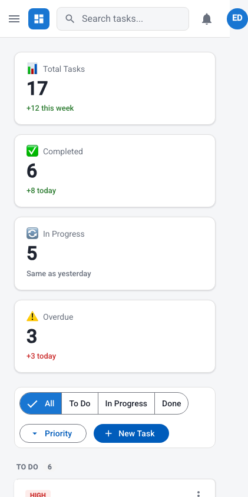
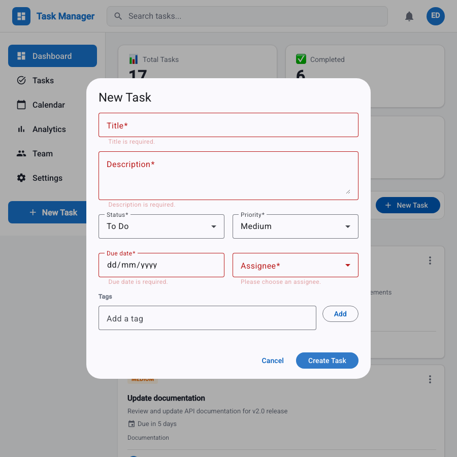

# Task Management Dashboard

A production-shaped Task Management Dashboard built for a senior Angular
developer assignment — Angular 22 (zoneless, standalone, Signals),
Angular Material, `httpResource`, Reactive Forms, Chart.js, and a
json-server mock backend, matching the provided Figma design.

**Live repo:** https://github.com/TheViper17/task-management-dashboard

> The brief asked for Angular 20/21.next. `@angular/cli@latest` resolved
> to **Angular 22.1.5** (current stable at the time of writing) — kept
> deliberately, since it's a strict superset of what was asked and ships
> `httpResource` as **stable** public API rather than developer-preview.
> See [Architecture Decisions](#architecture-decisions) for the reasoning
> behind every other non-obvious choice below.

---

## Table of contents

- [Screenshots](#screenshots)
- [Features](#features)
- [Getting started](#getting-started)
- [Available scripts](#available-scripts)
- [Environment configuration](#environment-configuration)
- [Architecture decisions](#architecture-decisions)
- [State management](#state-management)
- [Forms](#forms)
- [Testing strategy](#testing-strategy)
- [Performance optimizations](#performance-optimizations)
- [Accessibility](#accessibility)
- [Docker](#docker)
- [CI](#ci)
- [Known limitations & future improvements](#known-limitations--future-improvements)

---

## Screenshots

| Dashboard                                    | Analytics                                    |
| -------------------------------------------- | -------------------------------------------- |
|  |  |

| Mobile (390px)                         | Create task, validation errors                            |
| -------------------------------------- | --------------------------------------------------------- |
|  |  |

---

## Features

**Task management** — create, edit (modal, reactive form), delete (with
confirmation), filter by status/priority/assignee, real-time search,
drag-and-drop between and within columns.

**Dashboard** — 4 live stat cards, priority/status distribution charts
(Chart.js), a recent-activity feed, a team directory with live per-user
task counts.

**Everything the brief's "Must Do" list asks for**: standalone components
throughout, Signals for state, smart/presentational split, `httpResource`
for reads, HTTP-interceptor response caching, OnPush everywhere, lazy
loading per feature, Reactive Forms with custom validators and a dynamic
`FormArray`, Angular Material, responsive layout, skeleton/error states,
≥80% enforced test coverage, ESLint + Prettier + Husky, conventional
commits.

---

## Getting started

### Prerequisites

- Node.js **24.x** (the exact version this was built and CI-tested against;
  Angular 22 supports `^20.19 || ^22.12 || ^24`, so 22.12+ also works)
- npm 11.x (ships with Node 24)

### Installation

```bash
git clone https://github.com/TheViper17/task-management-dashboard.git
cd task-management-dashboard
npm install
```

`npm install` also runs `prepare` (Husky), wiring the pre-commit /
commit-msg / pre-push git hooks automatically — no separate setup step.

### Running it

```bash
npm run dev
```

This runs the Angular dev server (`:4200`) and the json-server mock API
(`:3000`) together via `concurrently`. Angular's dev-server proxy
(`proxy.conf.json`) forwards `/api/*` to `:3000`, so the app always calls
a same-origin `/api/...` path — in dev via the proxy, in production via
nginx (see [Docker](#docker)).

Open **http://localhost:4200**.

To run either piece alone: `npm start` (Angular only) or `npm run api`
(json-server only, needed if you're pointing the frontend at it from
somewhere else).

---

## Available scripts

| Script                  | What it does                                                                  |
| ----------------------- | ----------------------------------------------------------------------------- |
| `npm run dev`           | Angular dev server + json-server together                                     |
| `npm start`             | Angular dev server only (`:4200`)                                             |
| `npm run api`           | json-server only (`:3000`)                                                    |
| `npm run db:reset`      | Regenerates `mock-api/db.json` with dates relative to _today_                 |
| `npm run build`         | Production build (`dist/task-management-dashboard/browser`)                   |
| `npm run watch`         | Development-mode build, rebuilds on change                                    |
| `npm test`              | Runs the unit test suite once (Vitest); **fails if coverage drops below 80%** |
| `npm run test:watch`    | Unit tests in watch mode                                                      |
| `npm run test:coverage` | Explicit coverage run (equivalent to `npm test` — coverage is always on)      |
| `npm run lint`          | ESLint, zero warnings tolerated                                               |
| `npm run lint:fix`      | ESLint with autofix                                                           |
| `npm run format`        | Prettier, writes                                                              |
| `npm run format:check`  | Prettier, checks only (what CI runs)                                          |

---

## Environment configuration

There's no `environment.ts`/`environment.prod.ts` split — the only
environment-sensitive value is the API base URL, and it's resolved the
same way in every environment: the app always calls the **relative**
path `/api/...` (see the `API_BASE_URL` injection token in
`app.config.ts`), and whatever's in front of it decides where that goes:

| Context               | `/api` is handled by                                                  |
| --------------------- | --------------------------------------------------------------------- |
| `npm run dev`         | Angular CLI dev-server proxy (`proxy.conf.json`) → `localhost:3000`   |
| `docker compose up`   | nginx (`nginx.conf`) → the `api` container, by service name           |
| Any other static host | Reverse-proxy `/api` to wherever json-server (or a real backend) runs |

The response-cache TTL (`CACHE_TTL_MS`, 30s) is likewise a plain provider
value in `app.config.ts`, not an environment file — there was never a
reason for it to differ between dev and prod for this app.

---

## Architecture decisions

### Folder structure

```
src/app/
├── core/            # singletons, no UI — models, api, interceptors, stores, tokens
├── shared/           # generic, reusable, presentational — atoms + a placeholder-page
├── layout/           # the persistent shell: Header, Sidebar, Shell (smart)
└── features/
    ├── dashboard/    # stat cards, toolbar, board — the main screen
    ├── tasks/        # the create/edit form + dialog service
    ├── analytics/    # charts + activity feed
    └── team/         # user directory
```

The dependency rule: `features → core, shared`, never the reverse, and
features don't import each other — **with one deliberate exception**:
`DashboardPage` and `Shell` both import `features/tasks/task-dialog.service`
to open the create/edit dialog. Duplicating that dialog-opening logic in
two places, or inventing a new architectural layer just to host one
shared service, would have cost more clarity than the exception costs.

### Smart / presentational split

Every "smart" component is a page (`DashboardPage`, `AnalyticsPage`,
`TeamPage`) or the layout shell (`Shell`) — the only components that
`inject()` a store or open a dialog. Everything else is a pure function
of its `input()`s emitting `output()`s, `ChangeDetectionStrategy.OnPush`,
with no injected domain state. That split is what makes ~30 of this
project's ~38 components testable as a plain render-and-assert, which is
most of how the 80% coverage bar was cleared without heavy `TestBed`
wiring per test.

### Zoneless

Angular 22 makes zoneless the default the moment `zone.js` isn't a
dependency (it isn't, here) — `provideZonelessChangeDetection()` is
still called explicitly in `app.config.ts` to state that intent rather
than lean on an absence. Combined with Signals + OnPush everywhere, this
removes an entire class of "why didn't the view update" debugging and is
a smaller shipped bundle.

### `httpResource`, and where it stops

`httpResource` (stable as of Angular 22) backs every _read_: `TaskStore`,
`UserStore`, `StatisticsStore` all fetch this way. But `TaskStore`'s
mutations (`create`/`update`/`remove`/`move`) go through the plain
`TaskApiService` (`HttpClient`) and then call `.update()`/`.set()` on the
resource's own writable signal directly — not through the resource's
async loader. `httpResource` is shaped for reactive re-fetching; a task
board with optimistic updates and rollback needs to mutate its own state
synchronously the instant a user acts, and reconcile with the server
after. Using the right tool for each half, and being explicit about why,
is the point — not forcing one abstraction to do both jobs.

### Interceptor order (a mistake I caught while building it)

`provideHttpClient(withInterceptors([cacheInterceptor, errorInterceptor, retryInterceptor]))`
— cache outermost, retry innermost. The original plan had retry and error
swapped. Building it surfaced the real question: if `retry` sits _outside_
`error`, it only ever sees already-mapped `AppError` objects and can't
tell a retryable 503 from a non-retryable 404 apart — the user would see
duplicate or wrong toasts. Retry has to sit closest to the backend, seeing
the raw `HttpErrorResponse`, and only once it's exhausted its attempts (or
declined to retry a 4xx) does the error reach the mapping/notification
layer. Documented in each interceptor's own JSDoc, not just here.

### Caching

`cacheInterceptor` caches GET responses in an injectable `HttpCacheStore`
(a plain `Map`, TTL-based) and invalidates every cached entry under a
resource's root the moment any non-GET request touches that resource —
so a create/update/delete is never left looking stale by a cache hit.

---

## State management

Signals + a per-domain "store" service (`TaskStore`, `UserStore`,
`StatisticsStore`, `ActivityStore`), no NgRx. The brief explicitly leans
this way ("Signals for reactive state management where appropriate"),
and a single-entity-type app like this doesn't carry NgRx's
action/reducer/effect boilerplate well enough to justify it.

The rule every store follows: **one array of state, everything else
derived.** `TaskStore.tasks` is the only thing actually stored;
`filteredTasks`, `columns`, `counts`, `priorityMix`, `statusMix` are all
`computed()` from it, so nothing can drift out of sync with the source of
truth by construction — there's no "did I forget to update the count
too" class of bug available to write.

**Optimistic updates, uniformly.** Every mutation (`create`, `update`,
`remove`, `move`) patches the signal immediately, calls the API, and
either reconciles with the real response or restores the previous
snapshot on failure. The drag-and-drop reorder math
(`computeTaskOrderPatches`) reduces cross-column moves to the same
primitive: recompute a column's final order, patch only the entries that
actually changed.

**The mock API's static seed numbers are never trusted for the headline
stat-card values** — `mergeLiveStatistics` overrides `value` with the
live count derived from `TaskStore`, while keeping the seed data's
`change`/`changeLabel` delta text (flavour the backend has no way for us
to derive). The seed data says "156 total tasks"; this repo's dataset
has 17. The card says 17.

---

## Forms

`TaskForm` (create/edit) demonstrates every item the brief lists under
"Forms":

- **Custom validators** (`features/tasks/validators/task.validators.ts`,
  unit-tested independently of any component): `notInPastValidator`,
  `assigneeExistsValidator` (checks against the _live_ assignee list via
  a getter, not a snapshot), `maxTagsValidator`, `nonBlankValidator`.
- **Dynamic form controls**: `tags` is a `FormArray` the user grows and
  shrinks, capped at 5.
- **Form state management**: the due-date validator itself changes
  between create and edit mode — a brand-new task can't be created
  already overdue, but editing an already-overdue task shouldn't force
  its date forward just to satisfy the same rule.
- **Error handling and display**: touched-gated `mat-error` per field;
  the submit button is deliberately never `disabled` — clicking it while
  invalid calls `markAllAsTouched()` to reveal every error at once,
  standard and more helpful than a button that silently refuses to do
  anything.

---

## Testing strategy

**Vitest** (Angular 22's own default `ng test` runner, not swapped for
Jest) + **Angular Testing Library**, favouring behaviour-focused,
accessible queries (`getByRole`, `getByLabelText`) over implementation
details.

- **Pure functions** (`task.utils`, `date.utils`, `statistic.utils`,
  `board-drag-drop.utils`, the form validators) are tested directly with
  no Angular test machinery at all — this is where the reorder math,
  overdue logic, and relative-time formatting actually live, and where
  most of the edge cases are proven.
- **Presentational components** render with inputs and assert DOM +
  emitted outputs — no injected providers needed for ~30 of the ~38
  components in this app.
- **Stores** are tested with the relevant `*ApiService` mocked, asserting
  signal state after each command, including the optimistic-update and
  rollback-on-failure paths.
- **Interceptors** use `provideHttpClientTesting`: cache-hit-skips-network,
  retry timing (via `vi.useFakeTimers`), and error mapping are all
  asserted against a real `HttpClient` pipeline, not reimplemented.
- **Smart pages** get one broader test each, mocking their stores and
  services, driving the actual user flow (open a menu, click Delete,
  confirm, assert the store call).

**Coverage gate**: `angular.json`'s `test` target sets
`coverageThresholds` to 80% on statements/branches/functions/lines —
`ng test` (what CI runs) **fails the build**, not just reports a number,
if any of them drop below 80%. Current: **99%+ on all four** (see the
badge-style summary printed by `npm test`).

**One recurring gotcha, documented rather than hidden**: `mat-menu`
(used by every card's "more actions" menu and the priority filter)
depends on Angular's CDK Overlay, which needs _real_ timers to open —
faking `Date` for deterministic "today" in the same spec file that also
opens a menu needs `vi.useFakeTimers({ toFake: ['Date'] })`, not a bare
`vi.useFakeTimers()`, or the menu interaction silently hangs until the
test's own timeout. See `task-card.spec.ts` for the fix in context.

---

## Performance optimizations

- **`OnPush`** on every component — enforced by an ESLint rule
  (`@angular-eslint/prefer-on-push-component-change-detection`), not
  just a habit.
- **Zoneless** change detection (see [above](#zoneless)).
- **Lazy loading per feature**: every route (`dashboard`, `tasks`
  dialog, `analytics`, `team`) is its own `loadComponent` chunk. Verified
  by reading the actual build output, not assumed:
  - Registering Chart.js's `provideCharts(withDefaultRegisterables())`
    at the app root originally pulled all of Chart.js into the **eager**
    bundle even though `AnalyticsPage` is lazy — the initial bundle blew
    past the 500kB budget by 182kB for a chart a user might never open.
    Moving the provider onto `AnalyticsPage`'s own component `providers`
    dropped the initial bundle from **682kB → 471kB**.
- **HTTP response caching** via `cacheInterceptor` (see above), so
  navigating back to an already-fetched view doesn't always re-hit the
  network within the TTL window.
- **Retry with exponential backoff** on transient GET failures only
  (network errors, 5xx) — a 4xx or any non-GET is never retried, since
  retrying a non-idempotent request risks double-submitting it.
- **`@for` with `track`** everywhere a list renders (never index-based),
  so Angular can diff and reuse DOM nodes instead of tearing lists down
  and rebuilding them on every change.
- **`@defer`-shaped thinking without needing it**: heavy, rarely-visited
  features (Analytics/Chart.js, the Tasks dialog) are already
  route-boundary-lazy, which is the coarser but simpler tool for the
  same problem.

---

## Accessibility

- **Computed, not eyeballed, contrast**: every colour-token pair actually
  in use was checked against WCAG 2.1 AA (4.5:1 for text) with a small
  script rather than assumed correct because it "looked fine" — two
  genuinely failed (medium-priority badge text was 2.86:1; high-priority/
  overdue text was 4.35:1) and were corrected with the minimal darkening
  that clears 4.5:1 on every surface they're actually rendered against.
- **Skip-to-content link**, visible on keyboard focus.
- **`:focus-visible`** styled globally, not suppressed.
- **`prefers-reduced-motion`** collapses every animation (including the
  loading-skeleton pulse) to near-instant globally, once, rather than
  per-component.
- Chart.js draws to a `<canvas>`, which is both invisible to screen
  readers and can't read CSS custom properties — every chart also
  renders an `.sr-only` list exposing the same numbers as real,
  readable text, and its colours are the same palette duplicated as
  literal hex (documented inline as to why).
- Every icon-only button has an `aria-label`; every decorative icon is
  `aria-hidden`; `routerLinkActive` drives `aria-current="page"`.
- The responsive sidebar drawer is Angular Material's `MatSidenav`,
  which brings backdrop, focus-trapping (in `'over'` mode), and
  keyboard/Escape handling for free rather than reimplementing them.

Full WCAG 2.1 AA compliance (the brief's bonus item) hasn't been audited
with a tool like axe or Lighthouse — see
[Known limitations](#known-limitations--future-improvements).

---

## Docker

```bash
docker compose up --build
```

- `web` → http://localhost:8080 (nginx serving the production Angular
  build, proxying `/api/*` to the `api` container)
- `api` → http://localhost:3000 (json-server, also reachable directly)

One `Dockerfile`, two build targets (`api`, `web`) sharing a `deps` stage
so `npm ci` only runs once. `docker-compose.yml` builds both from that
one file.

> **Honest caveat**: Docker isn't installed in the environment this was
> built in, so this was written carefully and had every file path it
> references verified to exist, but **could not be run end-to-end**
> (`docker compose up`) to prove it. If something doesn't come up
> cleanly, the two most likely spots are the nginx `proxy_pass` rewrite
> in `nginx.conf` and the `browser/` subpath in the `COPY --from=build`
> line (Angular's application builder nests client output there even
> with SSR disabled).

---

## CI

`.github/workflows/ci.yml` runs on every push/PR to `main`: lint +
format check, the full test suite (which itself enforces the 80%
coverage gate — a coverage drop fails the run, not just a report), and a
production build (catching AOT/type errors dev mode can miss, and
enforcing the bundle budget). Three independent jobs, so a lint failure
doesn't block you from seeing whether tests also failed.

---

## Known limitations & future improvements

- **No authentication.** Out of scope per the brief. The header's
  current-user avatar is just the first entry in the mocked user list —
  documented inline where that shortcut is taken (`Shell`).
- **Activity feed is synthesized, not real.** The mock API has no
  activity collection, so `ActivityStore` seeds itself from the most
  recently updated tasks on first load, then appends an entry per
  `TaskStore` command for the rest of the session, persisted to
  `localStorage`. It's a reasonable stand-in, not a real audit log.
- **`mock-api/db.json` drifts locally as you use the app** (json-server
  writes through). `npm run db:reset` regenerates it from the assignment's
  original generator with dates relative to _today_ — run it before a
  demo if the data's gotten stale or messy.
- **i18n**: not implemented (bonus item). Every user-facing string is a
  literal in its template; there's no `$localize`/locale infrastructure.
- **Lighthouse / formal WCAG audit**: not run (bonus items). The a11y
  work in this project (contrast computed and fixed, skip link, focus
  management, sr-only chart summaries) was done to genuinely hold up
  under an audit, but no audit tool was actually run against it.
- **Docker**: written but not run end-to-end in this environment — see
  the caveat [above](#docker).
- **Calendar / Settings** are intentionally unbuilt placeholder routes —
  present in the Figma sidebar, not in the brief's functional
  requirements.
- **Drag-and-drop keyboard accessibility**: Angular CDK's drag-drop
  doesn't ship full keyboard-driven reordering out of the box. The
  mitigation already in place: every status change reachable by drag is
  _also_ reachable through the fully keyboard-accessible Edit form (a
  `mat-select`), so no functionality is drag-only.
- **If this grew past 4 users**: `TeamPage`'s per-user task count is an
  O(tasks) scan on every render via a `computed()` — fine at this scale,
  would want a `Map` built once per `tasks()` change instead at real
  scale (an easy follow-up, not done pre-emptively since premature
  optimization here would have been exactly that).
